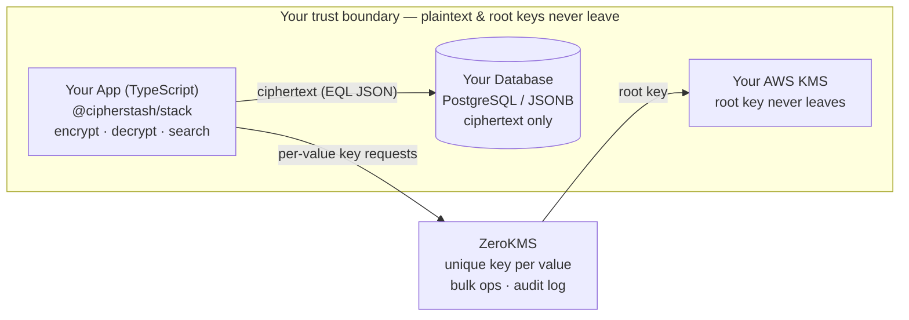

# README visual assets — spec

Two visual assets for the refreshed root `README.md`. Both target the gaps competitor
READMEs leave open:

1. **Architecture diagram** — security/infra READMEs (Infisical, Vault) bury their architecture
   off-README. A clear "how it works" diagram is the single biggest trust signal we can add.
2. **Type-safety autocomplete GIF** — none of the TS-first leaders (Prisma, Drizzle, React Email)
   *show* their type-safety story; they only describe it. An autocomplete GIF beats all of them.

## Shared conventions

- **Host in-repo** under `docs/images/` so assets are version-controlled.
- **Reference with absolute URLs** (`https://raw.githubusercontent.com/cipherstash/stack/main/docs/images/...`).
  Relative paths render on GitHub but **break on the npm package page** — npm needs absolute URLs.
- **Light + dark variants** using GitHub's mode switch:
  ```html
  
  
  ```
- **Brand**: use the CipherStash palette and logo; match the dark-theme look of cipherstash.com.
- **Accessibility**: every asset needs descriptive `alt` text (provided below). For the GIF, keep motion
  calm and the loop short (respect users who dislike motion).

---

## Asset 1 — Architecture diagram ("How it works")

**Goal.** In one glance, prove the core trust claim: *plaintext and root keys never reach CipherStash; the
database only ever holds ciphertext; every decryption is audited.*

**Placement.** Under the `## How it works` heading, above the "Security architecture" doc link.

**Format.** SVG preferred (crisp, tiny, theme-able). Target ~1400px wide, responsive height.

**Layout (left → right data flow):**

```
┌─────────────────────────┐        ciphertext         ┌──────────────────────────┐
│  YOUR APP (TypeScript)   │  ── EQL JSON payload ──▶  │  YOUR DATABASE           │
│  @cipherstash/stack      │                           │  PostgreSQL / JSONB      │
│  • encrypt / decrypt     │  ◀── encrypted rows ───   │  • stores ciphertext only│
│  • search on ciphertext  │                           │  • searchable (EQL)      │
└───────────┬─────────────┘                           └──────────────────────────┘
            │  per-value key requests (bulk)
            ▼
┌─────────────────────────┐   root key   ┌──────────────────────────┐
│  ZeroKMS                 │ ───────────▶ │  YOUR AWS KMS            │
│  • unique key per value  │              │  • root key never leaves │
│  • bulk key ops (fast)   │              └──────────────────────────┘
│  • decryption audit log  │
└─────────────────────────┘
```

**Trust-boundary callouts to overlay (the persuasive part):**
- A dashed "trust boundary" line around *Your App + Your Database + Your AWS KMS* labelled
  **"Plaintext and root keys never leave your boundary."**
- A badge on ZeroKMS: **"CipherStash never sees plaintext."**
- A small tag near the audit log: **"Every decryption logged → SOC 2 / ISO 27001 evidence."**

**Alt text:**
> "CipherStash architecture: encryption and decryption happen in your TypeScript app; only ciphertext
> (EQL JSON) is stored in your PostgreSQL database. ZeroKMS issues a unique key per value, rooted in your
> own AWS KMS. Plaintext and root keys never reach CipherStash, and every decryption is logged for audit."

**Tooling.** Figma, Excalidraw, or draw.io → export SVG (light + dark). Keep text as real text (not
outlines) where possible for crispness and accessibility.

**Interim option (ship today, no designer needed).** GitHub renders Mermaid natively, so this can go in
immediately and be swapped for the designed SVG later:



---

## Asset 2 — Type-safety / autocomplete GIF

**Goal.** Show the DX payoff in motion: an encrypted field stays **fully typed and queryable** — encryption
adds security without taking away autocomplete, inference, or compile-time safety.

**Placement.** Inside the `### 🔐 Searchable encryption` pillar, or a short "Developer experience" callout.

**Storyboard (single seamless loop, ≤ 10s):**
1. Show a schema: `encryptedTable("users", { email: encryptedColumn("email").equality().freeTextSearch() })`.
2. Type `await client.encryptModel(user, users)` and hover the result — tooltip shows the **schema-aware
   return type**: `email → Encrypted`, `id → string`, `createdAt → Date` (only schema fields change type).
3. Start typing a query: `.where(await ops.eq(usersTable.email, "` — show autocomplete offering the typed
   operator and the column.
4. Briefly trigger a **red squiggle** by accessing a field not in the schema (or wrong type) — proving
   errors are caught at compile time.

**Recording specs:**
- VS Code, clean theme (record a **dark** primary; a light alt is nice-to-have).
- Font size 16–18px; minimap off; hide activity/status bar clutter; zoom so code is legible on mobile.
- Crop tight to the editor region. Width 1280–1440px.
- Length 8–12s, seamless loop. **File budget < 5 MB** (ideally < 3 MB) so the README stays fast.

**Formats:**
- Ship a **`.gif`** for universal rendering (works on npm and GitHub).
- Optionally also provide an `.mp4`/`.webm` and embed via `<video autoplay loop muted playsinline>` on
  GitHub for higher quality — but keep the GIF as the npm-safe fallback.

**Tooling.** Kap, ScreenStudio, or Gifski for capture/encoding; or a scripted-typing tool for a clean take.
Compress with Gifski / `gifsicle -O3`.

**Alt text:**
> "Animated demo: defining a CipherStash encrypted schema in TypeScript, then encrypting a model. The editor
> shows full type inference — encrypted fields are typed as Encrypted while other fields keep their original
> types — and autocomplete works on encrypted columns when building a query."

---

## Asset 3 — Performance "flat latency" chart

**Goal.** Make the scaling claim visual: *encrypted query latency stays flat from 10k to 10M rows.* A
line that refuses to go up is more convincing than any table.

**Placement.** In the `## Performance` section of the root README, under the latency table (a TODO
comment marks the spot).

**Why not embed the existing benches charts?** Reviewed the `cipherstash/benches` repo:

- `report/query_*_chart.png` — matplotlib internal-report style; each chart also plots a
  "with decryption" series (~24 ms, dominated by round-trip decrypt cost) that visually buries the
  sub-millisecond headline. Light-theme only. Not README-quality.
- `kms-app/results-ec2/**/latency.svg` / `throughput.svg` — the ZeroKMS vs AWS KMS story, cleanly
  styled and the closest embeddable candidate, but light-theme only and annotated with red
  "had failures" markers (on ZeroKMS points too, in the throughput chart) that invite the wrong
  questions in a marketing context.

**Spec.**

- Line chart, x-axis: rows (log scale: 10k · 100k · 1M · 10M); y-axis: median query latency (ms).
- Three flat lines near the floor: equality (~0.1 ms), range (~0.5 ms), JSON field equality (~0.1 ms).
- Optional fourth reference: a subtle plaintext-baseline band, showing encrypted ≈ plaintext.
- Callout label: **"Latency stays flat from 10k → 10M rows."**
- Theme-aware light/dark SVG pair, same `<picture>` treatment and palette as the architecture diagram.
- Regenerate from `cipherstash/benches` data on each benchmark refresh; attribute the repo in the caption.

**Alt text:**
> "Line chart of median encrypted-query latency versus table size. Equality, range, and JSON queries
> hold steady at well under one millisecond as row counts grow from ten thousand to ten million."

**Stretch:** a second chart for the ZeroKMS vs AWS KMS bulk-key story (up to 14× throughput, 10,000
keys per call) — a two-bar or two-line comparison redrawn in brand style from `kms-app` data.

---

## Asset 4 — Repo social preview card (og:image)

**Goal.** Control the link preview when the repo is shared (Slack, Discord, X, LinkedIn, …). Without
it, GitHub serves an auto-generated card — repo name plus contributor stats — that says nothing about
what the Stack does.

**Placement.** Not embedded in the README: uploaded via **repo Settings → General → Social preview**.
GitHub then serves it as `og:image` / `twitter:image` for links to the repo and its files (issues, PRs,
and commits keep their own auto-generated cards).

**Companion text.** The `og:description` comes from the repo's **About description** field — GitHub
doesn't allow arbitrary meta tags. Set it to the messaging brief's one-liner:
*"Searchable, application-level encryption for building privacy-first apps."*

**Spec.**

- **1280×640px** (2:1 ratio), PNG, under 1 MB (GitHub minimum 640×320).
- Single theme — no light/dark switching exists for og:images. Use the dark brand look of
  cipherstash.com, which also matches how most chat clients render cards.
- Content readable in one glance, three elements max: CipherStash logo + "CipherStash Stack" wordmark,
  the one-liner tagline, and a tiny code fragment selling the sizzle (e.g. `email eql_v3.text_match`
  or `.ilike("email", "%@acme.com") // runs on ciphertext`).
- **Safe margins:** keep text ≥64px from every edge — some clients crop edges and round corners.
- Keep the export in-repo (`docs/images/social-preview.png`) so it's version-controlled, even though
  GitHub serves its own uploaded copy.

**Shipping steps:** upload via Settings → Social preview, set the About description, then verify with
a fresh paste into Slack/Discord (previews are cached — use opengraph.xyz or similar to confirm).

---

## Suggested files

| File | Asset | Status |
|------|-------|--------|
| `docs/images/architecture-light.svg` | Architecture — desktop, light (1400×660) | ✅ shipped |
| `docs/images/architecture-dark.svg` | Architecture — desktop, dark (1400×660) | ✅ shipped |
| `docs/images/architecture-stacked-light.svg` | Architecture — mobile/stacked, light (760×1100) | ✅ shipped |
| `docs/images/architecture-stacked-dark.svg` | Architecture — mobile/stacked, dark (760×1100) | ✅ shipped |
| `docs/images/type-safety.gif` | Autocomplete/type-safety demo | todo |
| `docs/images/type-safety.mp4` | Optional higher-quality GitHub embed | todo |
| `docs/images/perf-latency-light.svg` | Flat-latency chart — light | todo |
| `docs/images/perf-latency-dark.svg` | Flat-latency chart — dark | todo |
| `docs/images/social-preview.png` | Repo social preview card (1280×640) | todo |

The architecture diagram is embedded in the README via a single `<picture>` element that selects one
of the four variants from **two** dimensions at once — theme (`prefers-color-scheme`) and viewport width
(`max-width: 600px`) — with the desktop-light `` as the universal fallback for npm and older
renderers. `<source>` order is most-specific first (dark+narrow → dark → light+narrow → fallback).

> **Pre-merge TODO:** while the PR is open, the four paths are **relative** (`docs/images/…`) so they
> preview on the branch. They must be restored to the absolute
> `https://raw.githubusercontent.com/cipherstash/stack/main/docs/images/…` prefix before merge, or they
> render on GitHub but break on the npm package page.
