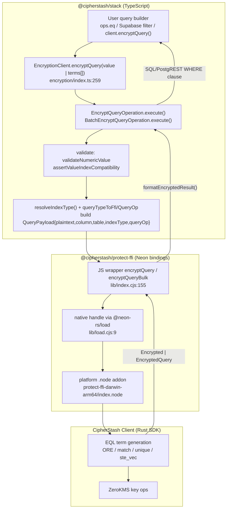
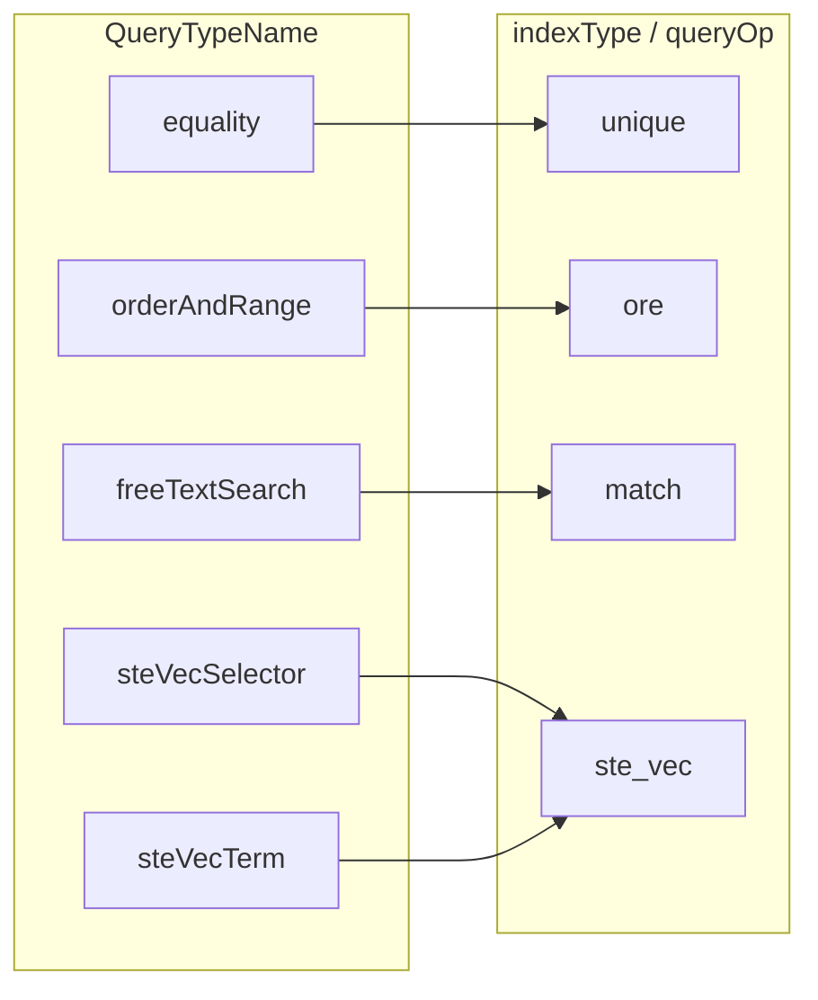

# Query API Walkthrough — API → FFI → CipherStash Client

How a query value travels from the public API down to the Rust SDK across the FFI boundary. Terse by design.

## Flow

## Layers

| # | Layer | Entry point | Role |
|---|-------|-------------|------|
| 1 | Public API | `encryption/index.ts:259/270` `encryptQuery()` | Overloaded: single value → `EncryptQueryOperation`; `ScalarQueryTerm[]` → `BatchEncryptQueryOperation`. |
| 1a | Query builders | `drizzle/operators.ts:976`, `supabase/query-builder.ts:44` | `eq/gt/...` operators & deferred builders that batch-encrypt RHS values, then emit a WHERE clause. |
| 2 | Operations | `operations/encrypt-query.ts:41`, `operations/batch-encrypt-query.ts:115` | `execute()`: validate → resolve index → call FFI. `*WithLockContext` resolves `LockContextInput` via `resolveLockContext` before the FFI call. |
| 3 | EQL resolution | `helpers/infer-index-type.ts:89`, `types.ts:292` | `resolveIndexType` + `queryTypeToFfi`/`queryTypeToQueryOp` map public `QueryTypeName` → FFI `indexType`/`queryOp`. |
| 4 | FFI JS wrapper | `protect-ffi/lib/index.cjs:155` | `encryptQuery`/`encryptQueryBulk` → `wrapAsync(native.*)`. |
| 5 | Native loader | `protect-ffi/lib/load.cjs:9` | `@neon-rs/load` proxies to the platform prebuilt `.node`. |
| 6 | Rust SDK | compiled into `.node` | CipherStash Client: encryption, EQL/ORE/STE-vec term gen, ZeroKMS. Not a JS dep — shipped inside the addon. |

## Query-type mapping (Layer 3)

## Notes

- **Client init:** `EncryptionClient.init()` (`encryption/index.ts:81`) calls FFI `newClient()` once; the returned `Client` handle is passed into every `encryptQuery` call.
- **`cipherstashclient`** = the CipherStash Client **Rust SDK**, compiled via Neon into the platform `.node` binary inside `@cipherstash/protect-ffi`. It performs the actual crypto and talks to ZeroKMS.
- **Result shape:** `EncryptedQueryResult` (`types.ts:175`); shaped by `formatEncryptedResult(..., returnType)` (`eql` vs raw).
- **Version:** `package.json` pins `@cipherstash/protect-ffi@0.24.0` (installed tree observed at `0.23.0` — confirm before relying on it).
- `packages/protect/src/ffi/*` mirrors this flow under the older `protect` package name.
