# Catalog-Driven Architecture: A Walkthrough

This document traces the full pipeline that turns **one Rust catalog** into the entire
EQL `eql_v3` surface — the SQL installer, the Rust payload bindings, the TypeScript types,
the JSON Schemas, the encrypted test fixtures, and the property/matrix test suites.

The governing idea: **there is exactly one source of truth.** A scalar encrypted-domain
type is *one row* in `eql_domains::CATALOG`. Everything else — thousands of lines of SQL,
Rust, TypeScript, JSON Schema, and test scaffolding — is *derived* from that row, and CI
gates guarantee the derived artifacts never drift from it.

---

## 1. The Big Picture

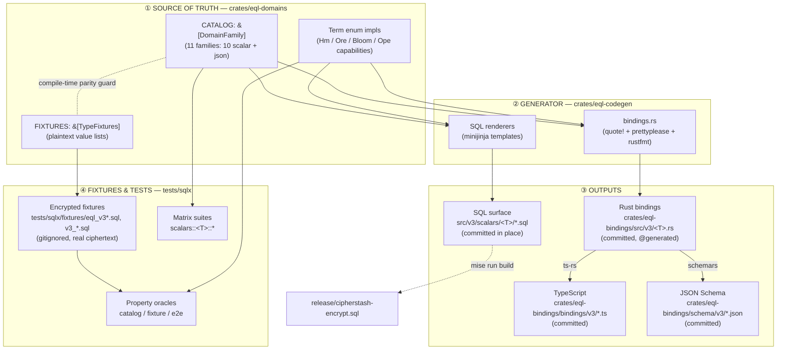

Three crates and three output trees:

| Crate | Role |
|-------|------|
| `crates/eql-domains` | **The catalog.** Pure-Rust, no DB, no chrono/decimal deps in the core. Declares families, domains, terms, and fixture plaintexts. Validated by `#[test]`s and the compiler. |
| `crates/eql-codegen` | **The generator.** Reads `CATALOG`, renders SQL (minijinja) and Rust bindings (`quote!`). Deterministic. |
| `crates/eql-bindings` | **The bindings.** Hand-written trait + newtypes, plus generated per-family structs. ts-rs and schemars derive TS/JSON off these. |

---

## 2. Layer ① — The Catalog (Source of Truth)

Everything starts in `crates/eql-domains/src/lib.rs`:

```rust
pub const CATALOG: &[DomainFamily] = &[
    INTEGER, SMALLINT, BIGINT, DATE, TIMESTAMP, NUMERIC, TEXT, BOOLEAN, REAL, DOUBLE, JSON,
];
```

Order is **load-bearing** — it drives generation order, inventory order, and snapshot order.
Ten of the eleven rows are `Shape::Scalar` families; the eleventh, `JSON`, is a **mixed** family —
three hand-written `Shape::SteVec` domains plus one generated `Shape::Scalar` storage domain
(`public.eql_v3_json`, rendered into `src/v3/scalars/json/` like any other storage-only domain; see §2.3).
Scalar-only consumers iterate `scalar_families()`, which filters `JSON` out wholesale (`is_scalar()`
is an `.all()`); the SQL/bindings generators instead iterate `families_with_scalar_domains()` and so
do render that storage domain.

### 2.1 The data model

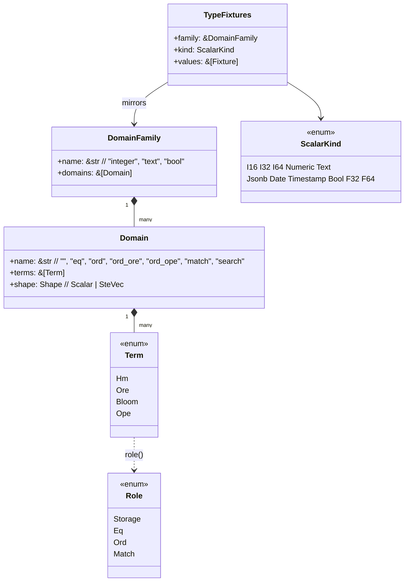

- **`DomainFamily`** = one scalar type (`name` + the public domains it carries).
- **`Domain`** = one operator/index capability surface (a bare suffix + fixed terms). The empty
  name `""` is the storage-only domain (`public.eql_v3_integer`); `eq`, `ord`, `ord_ore`, `ord_ope`,
  `match`, `search` are the searchable ones.
- **`Term`** = an index-term type. *This is where capability lives.*

### 2.2 The `Term` enum is the capability engine

A `Term` answers every question the generators need, via exhaustive `impl` methods
(`crates/eql-domains/src/term.rs`). This table *is* the contract:

| Method | `Hm` | `Ore` | `Bloom` | `Ope` |
|--------|------|-------|---------|-------|
| `json_key()` | `"hm"` | `"ob"` | `"bf"` | `"op"` |
| `extractor()` | `eq_term` | `ord_term_ore` | `match_term` | `ord_term` |
| `ctor()` | `hmac_256` | `ore_block_256` | `bloom_filter` | `ope_cllw` |
| `binding_newtype()` | `Hmac256` | `OreBlock256` | `BloomFilter` | `OpeCllw` |
| `role()` | `Eq` | `Ord` | `Match` | `Ord` |
| `operators()` | `= <>` | `= <> < <= > >=` | `@@` | `= <> < <= > >=` |
| `provides_ordering()` | `false` | `true` | `false` | `true` |

`Ope` is the CLLW-OPE term: a hex-encoded ciphertext that is natively `bytea`-sortable after
hex-decode (no custom comparison protocol), so — like `Hm` — its extractor is the whole SEM
surface. The extractor name tracks the *domain* it serves, not the cipher: `Ope` backs the
default `_ord` domain and so takes the unqualified `ord_term`, while `Ore` — the by-name escape
hatch behind `_ord_ore` — takes the qualified `ord_term_ore`. The two names must stay distinct or
a mixed `[Ore, Ope]` domain would collapse under `dedupe_terms_by(Term::extractor)`.
`provides_ordering()` is `true` for **both** `Ore` and `Ope`.

Cross-term helpers compose these into the per-domain answers the renderers consume:
`operators_for_terms`, `term_json_keys`, `payload_terms`, `nonempty_array_keys`,
`extractor_terms`, `term_requires`, `extractor_for_operator`, `role_for_terms`.

> **Key insight:** Adding `bigint` adds *no new behavior code* — it reuses `Hm`/`Ore`.
> New behavior (a new index term) is a new `Term` variant with its `impl` arms + tests.
> Data (which types exist) is catalog rows; behavior (what terms do) is `Term` impls.

### 2.3 The domain shapes

Every current **scalar** family — every row in `eql_domains::scalar_families()` — uses
one of three catalog shapes. The invariant test `every_type_uses_a_known_domain_shape`
iterates `scalar_families()`, not the full `CATALOG`, and accepts these current shapes
plus two known-but-unused shapes (`eq-only` and `ordered+match`) so future scalar rows
fail loudly if they drift into an unreviewed shape. The eleventh `CATALOG` family,
`json`, is not scalar-shaped at all — see the note after the family table below.

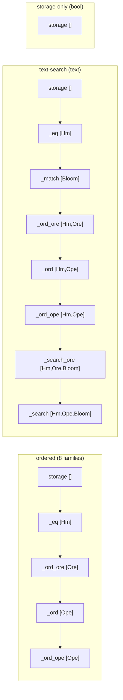

| Family | Kind | Shape |
|--------|------|-------|
| `integer`/`smallint`/`bigint` | I32/I16/I64 | ordered |
| `date`/`timestamp` | Date/Timestamp | ordered |
| `numeric` | Numeric | ordered |
| `real`/`double` | F32/F64 | ordered |
| `text` | Text | text-search (equality always routes through `Hm` — ORE is not equality-lossless for text) |
| `boolean` | Bool | storage-only (2-value cardinality leak → no searchable index) |

**`json` sits outside this classification.** It carries four domains. Three are
`Shape::SteVec` — `public.eql_v3_json_search` (document), `public.eql_v3_json_entry`
(one `sv` leaf), `eql_v3.query_json` (containment needle) — each with an empty flat
`terms` list: capability lives *structurally* inside the payload (per-`sv`-leaf `hm`
XOR `op`), not as a family-level `Term` set. The fourth is a generated `Shape::Scalar`
storage-only domain, `public.eql_v3_json` (bare `name: ""`, ciphertext-only `{v,i,c}`,
no index terms). `Domain.name` (`"search"`/`"entry"`/`"query"`, and `""` for the storage
domain) disambiguates which one a given domain is — see `Domain::rust_struct_name`.
`scalar_families()` filters `CATALOG` down to families whose domains are *all*
`Shape::Scalar`, so `json` never reaches `every_type_uses_a_known_domain_shape`, the
ordered-scalar materializer (§3), or the scalar SQLx matrix. Its three SteVec domains are
hand-written under `src/v3/json/` and their Rust structs in
`crates/eql-bindings/src/v3/json.rs`; the generated storage domain's SQL is rendered into
`src/v3/scalars/json/` and its struct into `crates/eql-bindings/src/v3/json_storage.rs`
(via `families_with_scalar_domains()`) — for the SteVec domains, only inventory membership
and `CATALOG` order are catalog-driven. This is also why the class diagram in §2.1 lists
`Jsonb` as a `ScalarKind` variant even though `json` is not a `Shape::Scalar` family:
`ScalarKind` and `Shape` are independent axes, and `JSON_FIXTURES`
(`crates/eql-domains/src/fixtures/record.rs`) needs a `ScalarKind` purely for the
`FIXTURES`/`CATALOG` parity machinery.

### 2.4 Fixtures live beside the catalog

`crates/eql-domains/src/fixtures/record.rs` declares a `TypeFixtures` per family, mirroring
`CATALOG` 1:1. A **compile-time parity block** asserts `FIXTURES.len() == CATALOG.len()` and
that names/kinds align by index — a mismatch is a *build error*, not a runtime surprise.

```rust
pub const INTEGER_FIXTURES: TypeFixtures = TypeFixtures {
    family: &crate::INTEGER,
    kind: ScalarKind::I32,
    values: fixtures!(int i32;
        Min, N(-100), N(-1), Zero, N(1), /* ... */ N(9999), Max),
};
```

The `int_values!` / `text_values!` macros materialize these to typed const slices
(`INTEGER_VALUES: &[i32]`, `TEXT_VALUES: &[&str]`) at compile time — resolving `Min`/`Max`/`Zero`
sentinels to kind bounds and **panicking the build on an out-of-range integer literal**. No
generated `.rs` round-trip; the source of truth is the catalog row itself.

---

## 3. Layer ② — The Generator (`eql-codegen`)

The CLI (`crates/eql-codegen/src/main.rs`) has six modes:

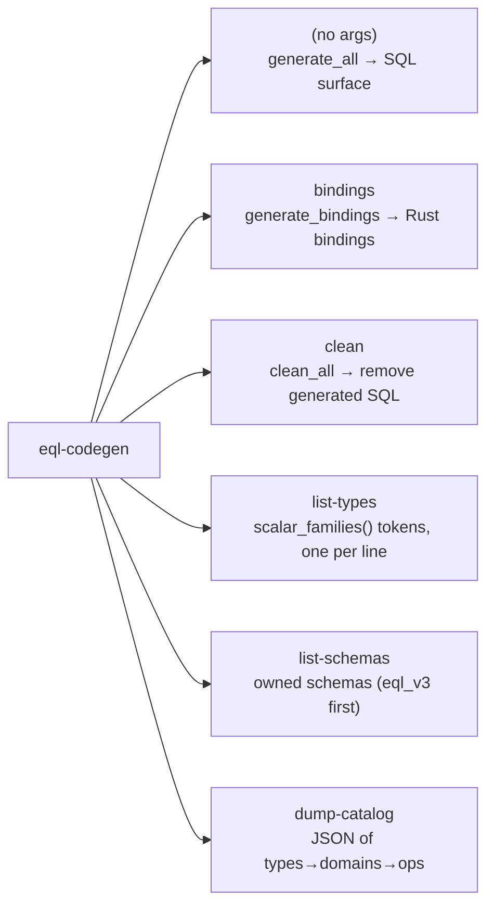

`list-schemas` prints the schemas the `eql_v3` surface owns (`eql_v3`, then `eql_v3_internal`),
consumed by `test:schemas:parity` to keep the Rust consts and the SQL `owned_schemas()` array in lockstep.

Both generators follow the same crash-safe **render-all → preflight → write-all →
delete-orphans** model, so a render panic or write error can never leave the tree
with files deleted-but-not-rewritten:

- Everything is rendered to memory FIRST, so a render panic (an unmapped domain
  name, a failing `rustfmt`) aborts before the filesystem is touched at all.
- Each file is written via an atomic same-directory temp-file + `rename`, so a
  reader (or an aborted run) never observes a truncated, half-written file.
- Stale generated files are deleted only AFTER every current file has been
  written. Deletion is marker-aware (only files carrying the AUTO-GENERATED /
  `@generated` marker are removed), so hand-written files always survive. The SQL
  pass additionally sweeps orphaned type dirs for types dropped from the catalog —
  the responsibility `tasks/build.sh`'s filename-pattern `find -delete` used to
  own, now inside codegen and marker-safe.

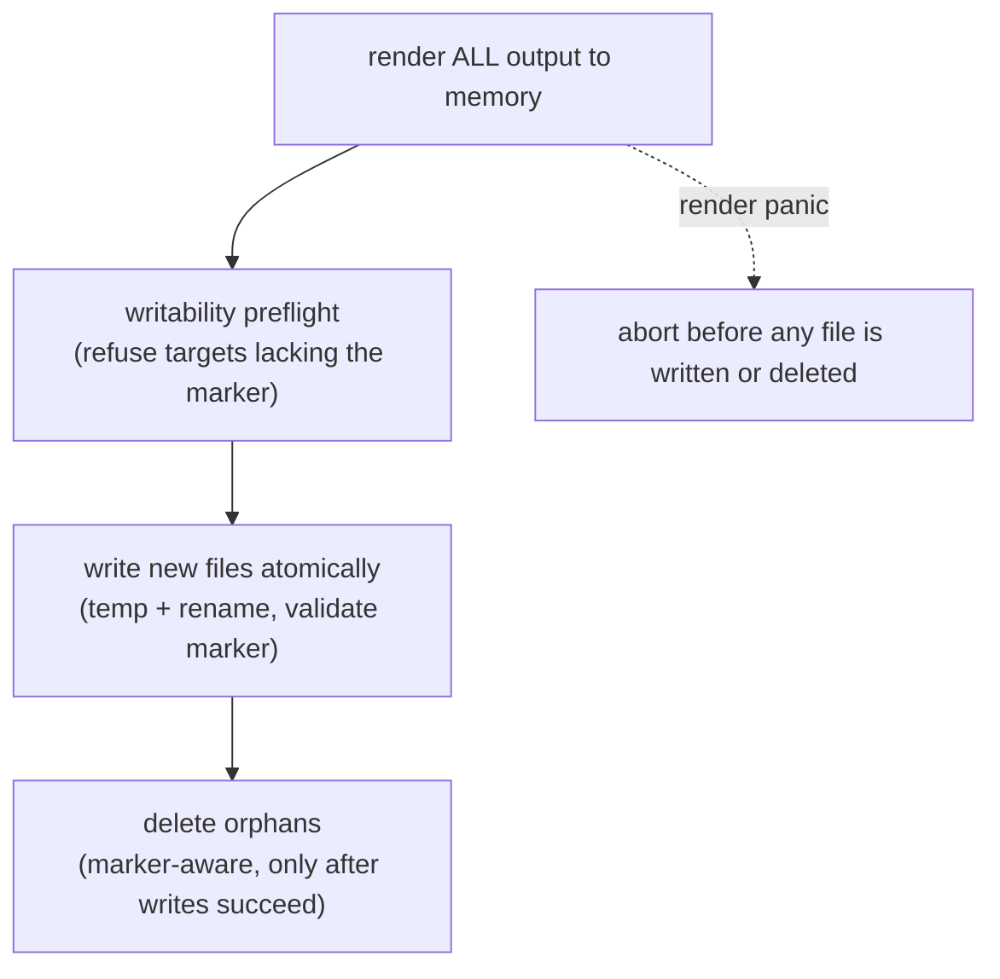

The Rust bindings and the SQL surface are both committed in place and share this
discipline; `eql-codegen clean` exposes just the marker-aware SQL removal step.

### 3.1 SQL generation (`generate.rs` + `context.rs` + minijinja templates)

Per family, the renderers emit three surfaces into `src/v3/scalars/<family>/`: the
**column-domain** surface (types/functions/operators/aggregates), the **query-operand**
surface (`query_*` — one term-only `eql_v3.query_<T>_<dom>` twin per term-bearing
domain), and the **`json_entry` cross** surface (comparisons between the extracted
SteVec leaf `public.eql_v3_json_entry` and the family's query operands):

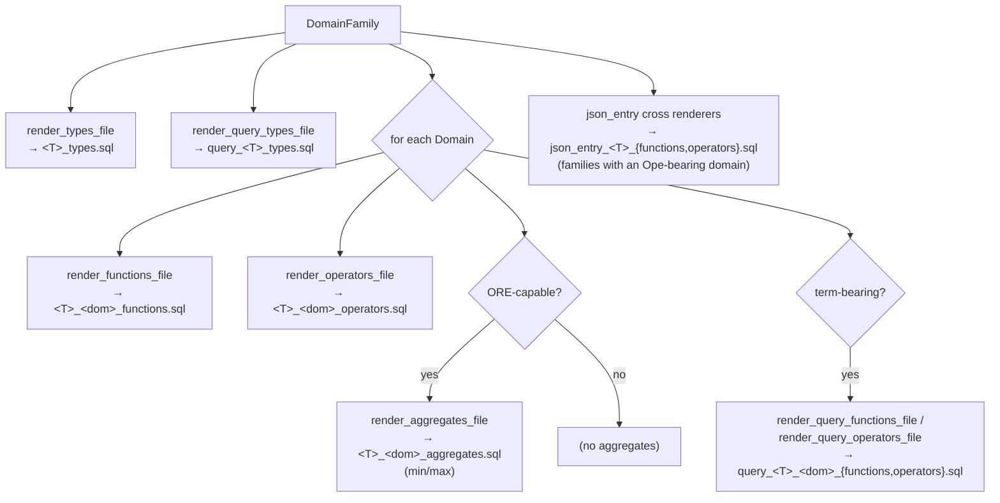

Each `*_functions.sql` mixes three entry kinds, selected per operator:

| Kind | Template | Language | Purpose |
|------|----------|----------|---------|
| **Extractor** | `functions/extractor.sql.j2` | `LANGUAGE sql` (inlinable) | `eq_term(integer_eq) → hmac_256` |
| **Wrapper** | `functions/wrapper.sql.j2` | `LANGUAGE sql` (inlinable) | `eq(a,b) → eq_term(a)=eq_term(b)` |
| **Blocker** | `functions/unsupported.sql.j2` | **`LANGUAGE plpgsql`** | `RAISE EXCEPTION 'operator % not supported'` |

> **Two footguns the renderers enforce structurally (with tests):**
> - **Blockers are never `STRICT`** — a `STRICT` blocker returns `NULL` on `NULL` args,
>   silently bypassing the exception.
> - **Blockers are `LANGUAGE plpgsql`, never `sql`** — a `LANGUAGE sql` body is inlinable
>   and the planner can elide it when the result is provably unused, killing the `RAISE`.
>   `plpgsql` is opaque to the planner, so the exception always fires.

### 3.2 Rust bindings generation (`bindings.rs`)

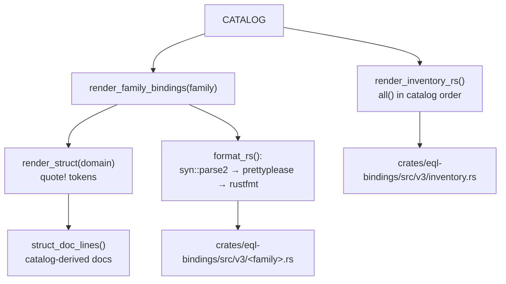

The struct doc is **derived entirely from catalog data** — no free-form prose:

```rust
/// `public.eql_v3_integer_eq` — equality domain.
///
/// Operators: `=` `<>`. Required keys: `v` `i` `c` `hm`.
```

`capability_label(domain.name)` produces the summary line and **panics on an unmapped
domain name** — making a new shape a compile error rather than a silent fallthrough. The
operators come from `Term::operators_for_terms`, the keys from
`ENVELOPE_KEYS ++ Term::term_json_keys`. The required-key list is where structural
distinctions become visible — e.g. `text_ord` lists `v i c hm op` (dual-term) versus
`integer_ord`'s `v i c op`, and `text_ord_ore` lists `v i c hm ob`.

### 3.3 Why output is byte-identical run-to-run

- **SQL:** minijinja with `keep_trailing_newline(true)`; fixed operator-metadata order
  (`COMMUTATOR, NEGATOR, RESTRICT, JOIN`); sorted file lists.
- **Rust:** `quote!` → `prettyplease::unparse()` (deterministic) → `rustfmt --edition 2021`
  (final byte-canonical form). Marker prepended as line 1.

> An identical `CATALOG` produces byte-identical output. If `mise run build` produces
> something unexpected, the change is in `eql-domains/src` or `eql-codegen/src` — never
> run-to-run noise.

---

## 4. Layer ③ — The Three Outputs

### 4.1 SQL surface — `src/v3/scalars/<T>/` (committed in place)

```text
src/v3/scalars/
├── functions.sql          ← hand-written shared blocker helper (COMMITTED)
├── integer/               (25 generated files)
│   ├── integer_types.sql              (generated, committed)
│   ├── integer_functions.sql          (storage-only blockers)
│   ├── integer_operators.sql          (storage-only operator blockers)
│   ├── integer_eq_functions.sql       (eq_term extractor + eq/neq wrappers)
│   ├── integer_eq_operators.sql       (CREATE OPERATOR)
│   ├── integer_ord_ore_functions.sql
│   ├── integer_ord_ore_operators.sql
│   ├── integer_ord_ore_aggregates.sql (min/max)
│   ├── integer_ord_functions.sql
│   ├── integer_ord_operators.sql
│   ├── integer_ord_aggregates.sql     (min/max)
│   ├── integer_ord_ope_functions.sql
│   ├── integer_ord_ope_operators.sql
│   ├── integer_ord_ope_aggregates.sql (min/max)
│   ├── query_integer_types.sql        (eql_v3.query_* operand domains, term-only)
│   ├── query_integer_eq_functions.sql       ┐
│   ├── query_integer_eq_operators.sql       │ one functions/operators pair
│   ├── query_integer_ord_functions.sql      │ per term-bearing domain
│   ├── query_integer_ord_operators.sql      │
│   ├── query_integer_ord_ore_functions.sql  │
│   ├── query_integer_ord_ore_operators.sql  │
│   ├── query_integer_ord_ope_functions.sql  │
│   ├── query_integer_ord_ope_operators.sql  ┘
│   ├── json_entry_integer_functions.sql (json_entry ↔ query-operand cross surface)
│   └── json_entry_integer_operators.sql
│   (integer_extensions.sql ← hand-written, COMMITTED, only if present)
└── ...
```

The four generated patterns (`*_types.sql`, `*_functions.sql`,
`*_operators.sql`, `*_aggregates.sql`) are committed in place and regenerated on every
`mise run build`. Generated files carry the `-- AUTOMATICALLY GENERATED FILE.` header that `docs:validate`
greps on. Domains are `CREATE DOMAIN ... AS jsonb` with envelope + term-key `CHECK`s (and
ORE non-empty-array checks), never domain-over-domain.

### 4.2 Rust bindings — `crates/eql-bindings/src/v3/` (committed)

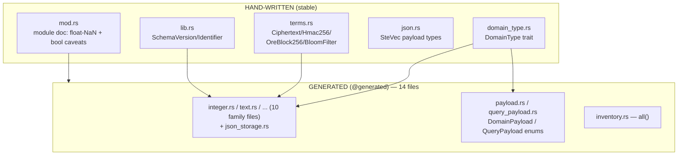

A generated struct (`integer.rs`):

```rust
// @generated by eql-codegen from the eql-domains catalog — do not edit
/// `public.eql_v3_integer_eq` — equality domain.
///
/// Operators: `=` `<>`. Required keys: `v` `i` `c` `hm`.
#[derive(Clone, Debug, PartialEq, Serialize, Deserialize, TS, JsonSchema)]
#[ts(export, export_to = "v3/")]
#[serde(deny_unknown_fields)]
pub struct IntegerEq {
    pub v: SchemaVersion,
    pub i: Identifier,
    pub c: Ciphertext,
    pub hm: Hmac256,
}

impl DomainType for IntegerEq {
    fn sql_domain_static() -> &'static str { "public.eql_v3_integer_eq" }
    fn sql_domain(&self) -> &'static str { Self::sql_domain_static() }
    fn schema(&self) -> Schema { schema_for!(IntegerEq) }
}
```

The `v/i/c` envelope is hardcoded in the renderer but **lockstep-tested against
`ENVELOPE_KEYS`** (`envelope_fields_match_catalog_keys`). `inventory.rs::all()` enumerates
every domain as a `Box<dyn DomainType>` over `PhantomData<T>` (zero-sized — no payload
construction needed) in catalog order.

> **Why committed (unlike SQL)?** ts-rs and schemars derive the *committed* TS/JSON off
> these structs at `cargo test` time, so they must exist on a clean clone.

The module doc carries the **non-derivable** caveats: float **NaN** carries no comparison
guarantee (reject client-side), and **`boolean` is storage-only** (`{v,i,c}` only, every
operator blocked).

### 4.3 TypeScript & JSON Schema — `crates/eql-bindings/{bindings,schema}/v3/` (committed)

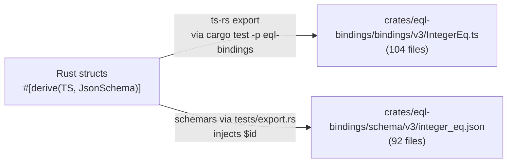

- **TypeScript:** one `.ts` per domain, importing co-located term types; newtypes become
  primitive aliases (`export type Ciphertext = string;`, `export type SchemaVersion = 3;`).
  Doc comments survive from Rust.
- **JSON Schema:** JSON Schema 2020-12 (schemars 1.x), `additionalProperties: false`,
  `$id` injected at export (`https://schemas.cipherstash.com/eql/v3/integer_eq.json`), term
  types as reusable `$defs`. `BloomFilter` and `SchemaVersion` have **manual** `JsonSchema`
  impls (bounded `i16[]`, `const: 3`) that derives can't express.

> **Per-field vs per-struct docs:** there are *no* per-field docs on generated structs.
> Per-term semantics live on the shared term newtypes in `terms.rs` (flowing into TS term
> files and JSON Schema `$defs`); per-family caveats live in `mod.rs`. Free-form prose
> belongs at the struct level only.

---

## 5. Layer ④ — Fixtures

EQL is searchable *encryption*: tests must run against **real ciphertext from the actual
crypto**, never synthetic blobs. Fixtures are generated by encrypting the catalog's
plaintext values through cipherstash-client.

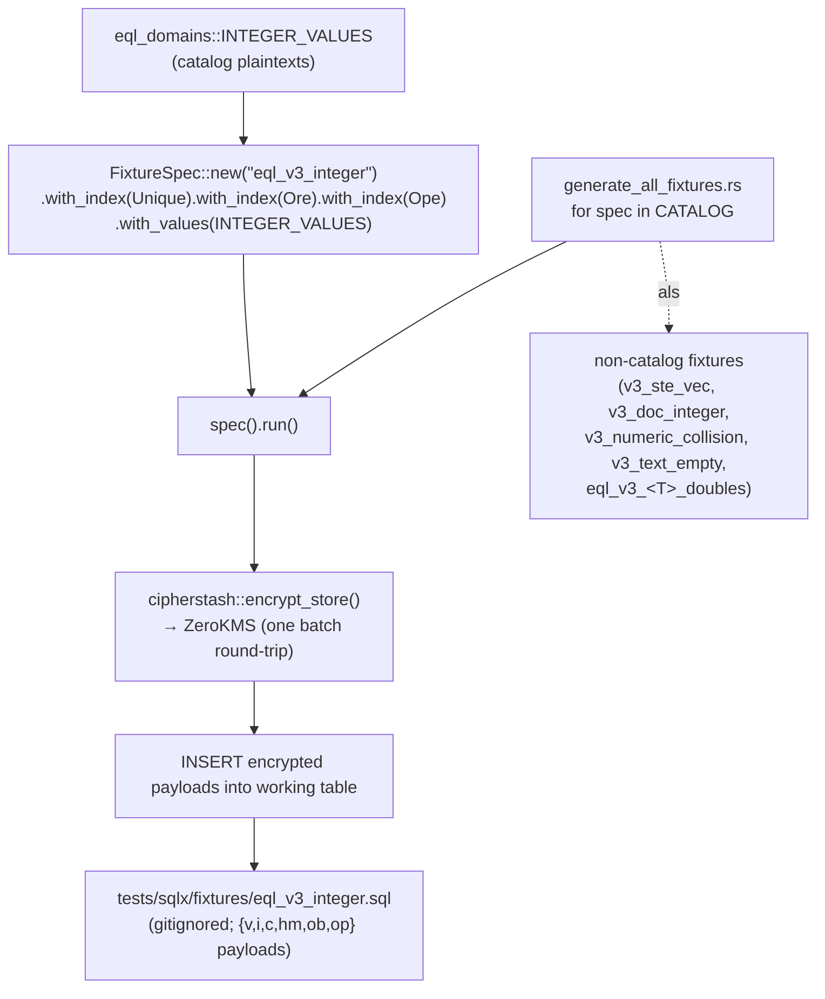

- The entry point (`generate_all_fixtures.rs`) **iterates `CATALOG` directly**, dispatching
  via a `scalar_types!(fixture_dispatch)` match with a **loud catch-all** — a catalog token
  with no fixture wiring fails, so silently-missing fixtures are impossible.
- Gated behind `--features fixture-gen`; requires CipherStash creds (ZeroKMS + client key).
  **CI has them.** This is by design — there are *no* committed/static fixture exceptions.
- Non-catalog fixtures (`v3_ste_vec`, `v3_doc_integer`, `v3_numeric_collision`,
  `v3_text_empty`, and per-type `eql_v3_<T>_doubles`) ride the same generation
  pipeline, so they are generated and gitignored too — not committed blobs.

---

## 6. Layer ④ — Tests

### 6.1 Three property-based suites (one oracle engine)

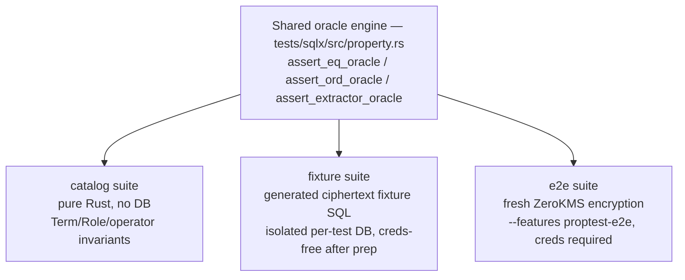

| Suite | Where | Inputs | DB / creds |
|-------|-------|--------|-----------|
| **catalog** | `crates/eql-domains/src/proptest_invariants.rs` | generated terms/kinds | none |
| **fixture** | `tests/sqlx/tests/encrypted_domain/property/fixture_oracle.rs` | generated fixture rows | per-test scratch DB |
| **e2e** | `tests/sqlx/tests/encrypted_domain/property/e2e_oracle.rs` | fresh-encrypted plaintexts | shared DB + `CS_*` creds |

The oracle: for all pairs `(a,b)`, `a = b` in SQL (via the `_eq` domain) **⟺**
`a.plaintext == b.plaintext`; ordering operators and the domain's ordering-extractor sort order agree with the
plaintext ordering. `cross_ciphertext.rs` additionally proves two independent encryptions of
the same plaintext compare equal (the unique-plaintext matrix fixture can't cover the
equality-true branch across *distinct* ciphertexts).

### 6.2 The matrix suite & its coverage snapshot

`scalar_types!(matrix_suites)` expands to `scalars::<T>::*` test modules; the
`scalar_matrix!` macro emits one `#[sqlx::test]` per `(category, domain, operator, pivot)`
tuple, with the domain set chosen by `caps`:

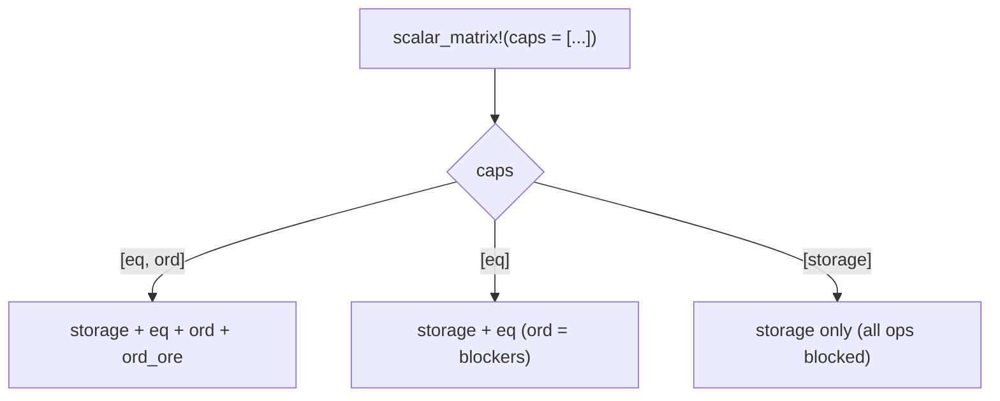

The coverage gate (`mise run test:matrix:inventory`, no DB) pins the *set of test names*
against four committed baselines under `tests/sqlx/snapshots/`:

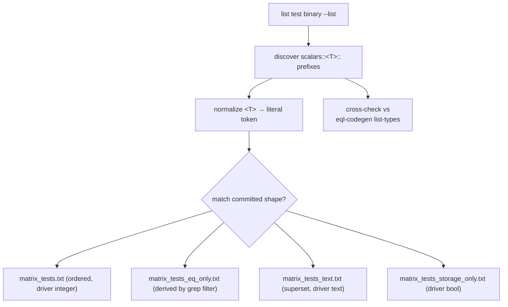

A silently dropped, renamed, or `#[cfg]`-gated test fails the diff; a catalog type missing
its matrix wiring fails the `list-types` cross-check. When you change which matrix tests the
macro emits, regenerate (`test:matrix:snapshots:regen`) and commit the baseline in the same
change.

Two **sibling** matrices sit beside these four scalar baselines, each with its own no-DB
inventory gate:

- `tests/sqlx/snapshots/ope_tests.txt` pins the CLLW-OPE (`<T>_ord_ope`) test-name set,
  gated by `mise run test:matrix:inventory:ope`.
- `tests/sqlx/snapshots/matrix_jsonb_entry_tests.txt` pins the `jsonb_entry::…` behaviour
  matrix, gated by `mise run test:matrix:inventory:jsonb_entry`.

### 6.3 Determinism & drift gates

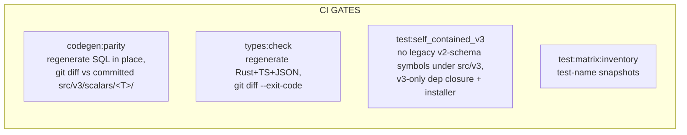

| Gate | Pattern | Catches |
|------|---------|---------|
| `codegen:parity` | regenerate SQL in place, `git diff --exit-code` + untracked check | renderer drift; uncommitted/hand-edited generated SQL |
| `types:check` | regenerate committed bindings, `git diff --exit-code` + untracked check | stale/hand-edited TS/JSON/Rust bindings |
| `test:self_contained_v3` | grep + dep-closure + installer scan | any legacy v2-schema symbol leaking into the v3 surface |
| `test:matrix:inventory` | normalized test-name set vs 4 baselines + `list-types` | dropped/renamed test; catalog type missing wiring |

`codegen:parity` and `types:check` are the same gate applied to two committed
generated targets: both regenerate in place and `git diff --exit-code`, because the SQL
surface and the bindings are both committed.

---

## 7. End-to-End: Adding a New Scalar Type

To see the whole machine, trace what *one catalog row* sets in motion. Per
`docs/reference/adding-a-scalar-encrypted-domain-type.md`, you write a single
`DomainFamily` (+ its `TypeFixtures` row + the `scalar_types!` harness entry):

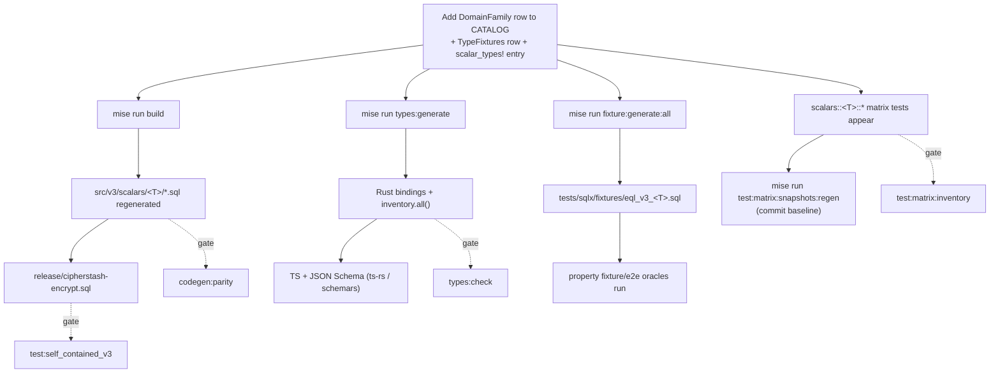

What you **do not** write: any SQL DDL, any Rust struct, any TypeScript, any JSON Schema,
any fixture blob, any per-test boilerplate. New *behavior* (a brand-new index term) is the
only thing that touches `impl` code — a new `Term` variant with its exhaustive arms and
tests. Everything else is one row, the compiler, and the generators.

---

## 8. Cheat Sheet — Where Things Live

| Concern | File |
|---------|------|
| The catalog | `crates/eql-domains/src/lib.rs` (`CATALOG`) |
| Term capabilities | `crates/eql-domains/src/term.rs` |
| Fixture plaintexts | `crates/eql-domains/src/fixtures/record.rs`, `crates/eql-domains/src/fixtures/values.rs` |
| Catalog invariant tests | `crates/eql-domains/src/tests.rs`, `crates/eql-domains/src/proptest_invariants.rs` |
| CLI | `crates/eql-codegen/src/main.rs` |
| SQL renderers | `crates/eql-codegen/src/generate.rs`, `crates/eql-codegen/src/context.rs`, `crates/eql-codegen/templates/*.j2` (extractor/wrapper/unsupported templates under `crates/eql-codegen/templates/functions/*.j2`) |
| Operator catalog | `crates/eql-codegen/src/operator_surface.rs` |
| Bindings renderer | `crates/eql-codegen/src/bindings.rs` |
| File-ownership guards | `crates/eql-codegen/src/writer.rs` |
| Hand-written bindings core | `crates/eql-bindings/src/v3/{mod,domain_type,terms}.rs`; `SchemaVersion`/`Identifier` in `crates/eql-bindings/src/lib.rs` |
| Generated bindings | `crates/eql-bindings/src/v3/<family>.rs`, `inventory.rs` |
| TS / JSON Schema | `crates/eql-bindings/bindings/v3/`, `crates/eql-bindings/schema/v3/` |
| Generated SQL | `src/v3/scalars/<T>/` (committed in place) |
| Encrypted fixtures | `tests/sqlx/fixtures/eql_v3*.sql`, `tests/sqlx/fixtures/v3_*.sql` (gitignored) |
| Fixture pipeline | `tests/sqlx/src/fixtures/{spec,driver,scalar_fixture}.rs` |
| Matrix macro | `tests/sqlx/src/matrix.rs` |
| Property oracles | `tests/sqlx/src/property.rs`, `tests/sqlx/tests/encrypted_domain/property/` |
| Snapshots | `tests/sqlx/snapshots/` |
| Gates | `mise.toml`, `tasks/codegen-parity.sh`, `tasks/test/self_contained_v3.sh` |
